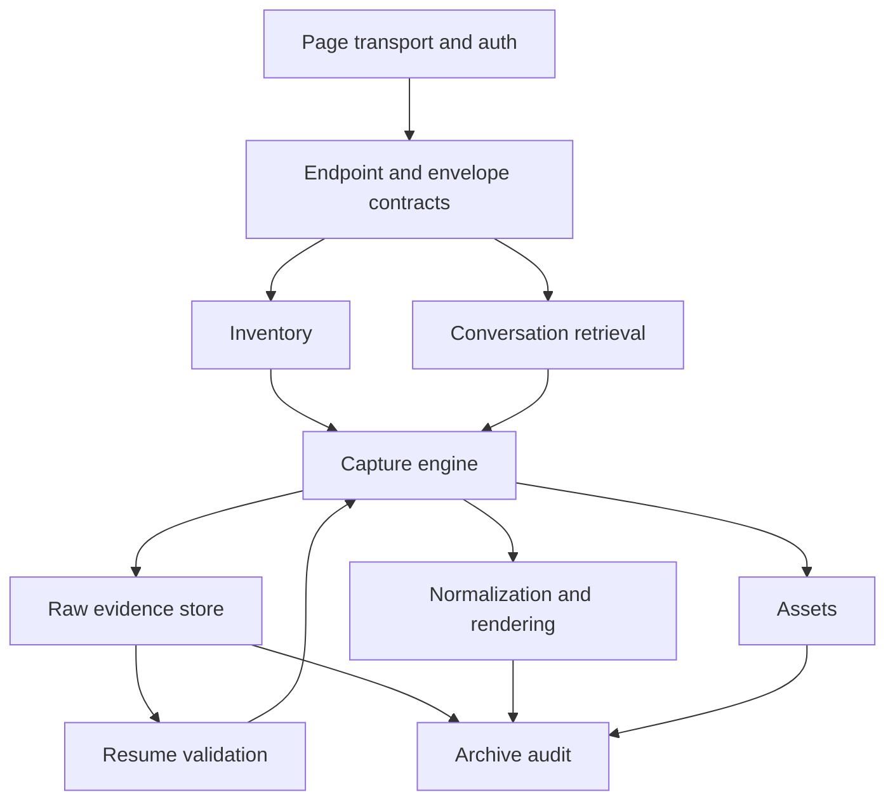

# ChatGPTExporter codebase audit — 2026-10-07

## 1. Is the documented web contract accurate enough?

Enough to exercise the supported client contracts and their failure boundaries. **Not enough to prove an exhaustive provider export.** No live ChatGPT account, private traffic, or credentials were used. The private API has no supplied authoritative completeness specification. Source, synthetic fixtures and dated external observations must remain separate.

Exact revisions and the complete operation/provenance matrix are in [contract-ledger-2026-10-07.md](contract-ledger-2026-10-07.md). Production baseline is fork main `274d878041403460a1249aa55b13d40769815bf2`. Documentation tip is `ccca15d86418d708ec61f719feacee883a8a3d1e`, not the job's older observed ref. Both CLI mains remain `254982ab784e4d13c7ab5f87de1522f9b047d0f5`; upstream exporter remains `c5618b3cc06eeb5b273d3727fe8729071441f291`. These refs were fetched on October 7.

Open upstream PR source diffs were inspected and their refs fetched: [siraht/ChatGPTExporter PR #1, Fix project inventory cursors and Windows path failures](https://github.com/siraht/ChatGPTExporter/pull/1), head `a5d668e6d8ebce89f850895be8477ca26ce12c6c`; [PR #2, fix(chatgpt): accept real-world project pagination cursors](https://github.com/siraht/ChatGPTExporter/pull/2), head `f220122808100036490bf30022beba9439df8408`; [PR #3, feat(extension): continuous capture progress counts and progress bar](https://github.com/siraht/ChatGPTExporter/pull/3), head `0c9d35ddea4700e734d5fd14dd3c06a5f99ae4cb`. All use base `c5618b3…`. None was merged into this audit. The first proposal isolates some 404 failures but does not supply the fork's plural adapter; it cannot simply be substituted for current code.

Corrections made to interpretive documentation and current README/WEB_CONTRACT:

- Historical cursor whitelist and missing plural lane are no longer presented as current fork limitations.
- The actual fork cursor bound is 2048 UTF-16 code units; 4096 belongs to an upstream proposal. No provider grammar is inferred from either.
- The request order is batch, plural recovery, then singular only on initial plural 404. History failures do not permit contract switching.
- Raw pages accumulate before terminal persistence; the source does not durably checkpoint each fetched page.
- Current-branch termination does not prove provider-graph/version completeness. The README's universal graph promise was unsupported.
- WEB_CONTRACT's auth statement was wrong: only 401 clears auth; 403 maps to WORKSPACE_FORBIDDEN. Challenge classification is not equivalent to auth classification.
- Inventory completion is not a stable account snapshot. CLI reports unreliable totals, concurrent movement and archived omissions.
- Historical statements praising independent audit are now qualified by actual tests. Frozen mirrors remain byte-for-byte unchanged.

## 2. Which tests follow from that contract?

[Invariants](invariants-2026-10-07.md) were recorded before new test implementation. The six added test files contain **194 new cases**. Tests use synthetic payloads and the real retrieval, endpoint, inventory, persistence, normalization, assets, retry and audit code. No production module was changed. Existing tests were preserved.

| Required family | New evidence |
|---|---|
| A — pagination | 1/3/80 pages; exactly 10,000 and beyond; missing/repeated/cyclic cursors; empty/overlap-only pages; stable and conflicting overlaps; current-node and identity boundaries |
| B — HTTP/fallback | Batch recovery reasons; exact request order; initial auth/408/429/5xx; history 404/429/5xx; initial-404 singular; retry exact cursor without duplicate messages |
| C — cursors | Three endpoint lanes, URL-sensitive characters, one character, exact 2048 bound, 2049 rejection, controls and Unicode local round trips |
| D — determinism | One/three/many pages and different overlaps; canonical JSON, Markdown, normalized messages; semantic metadata and nonempty asset indexes |
| E — diversity | User/assistant/system/developer/tool/future roles; text/code/citations/Canvas/browsing/research/multimodal/image/audio/file/future payload preservation on older pages |
| F — assets | Oldest-page assets, overlap, shared physical bytes, interrupted streamed write, network-free resume, failed assets, project/conversation context isolation |
| G — corruption/resume | Interrupt before each of four pages and derived write boundaries; corrupt completion; 17 evidence mutations tested separately against resume and audit with refreshed hashes |
| H — compatibility | Legacy batch/singular rebuild without network; insufficient disconnected graph and source-tag laundering rejected by required assertions |
| I — inventory races | Insertion, movement, duplicates, disappearance, scope union, count hints, repeated/malformed pages, missing authoritative inventory raw |
| J — isolation | Five simultaneous independent captures (batch/plural/failing/shared/assets), within-batch completed-unit survival, identity aliases and path collision probes |
| K — scale | 2,000-message synthetic history, retained-size bound, 10,000-page bound, deterministic parent-edge visit counter |
| L — privacy | Raw evidence excludes transport workspace id/session/header metadata; normal privacy scanner run unchanged |

Empty continuation pages with fresh cursors and null current-node behavior are local-policy probes, not newly asserted provider guarantees. Unicode issuance, shared-id association and version enumeration remain unknown. Metadata detailHash is provenance and may differ; canonical conversation JSON is required to exclude incidental pagination layout.

## Pre-repair results

| Check | Result |
|---|---|
| Untouched main checkout: npm run check | PASS: 19 files, 94 tests, typecheck, privacy, build |
| Expanded suite against unchanged production | 25 files, 288 tests: 247 PASS, 41 FAIL; no skips |
| Added tests alone | 194: 153 PASS, 41 FAIL |
| Expanded TypeScript typecheck | PASS |
| Build | PASS |
| Audit-branch privacy scan | FAIL: three synthetic cookie literals in the imported frozen CLI test mirror |
| Live ChatGPT / physical browser acceptance | NOT RUN |

Every failing assertion and harness correction is listed in the [pre-repair matrix](pre-repair-matrix-2026-10-07.md); full first/final JSON receipts and original check log are in [receipts](receipts/). The scanner findings are fixture false positives, not leaked credentials. It was not weakened or given blanket exceptions. Production defects remain failing ordinary tests, not expected-failure tests. No production repair was attempted.

## 3. How does the codebase perform under those tests?

### Concrete findings

| ID | Finding and consequence | Responsible source / reproducible tests |
|---|---|---|
| D01 | Audit returns complete after all 17 evidence mutations, including removed terminal page, wrong cursor, wrong identity, missing messages and source laundering, despite internally consistent rewritten hashes. | audit.ts verifyRawGraph checks mapping/message ID sets, not pagination replay; evidence-adversarial audit cases |
| D02 | Raw-marker validation checks cursor chain shape but not request operation/identity, response identity/messages, mapping agreement, or source-tag consistency. Legacy malformed graph marker also passes. Complete-marker reuse can therefore bypass semantic checks. | core/capture-store.ts validRawMarker/hasCompletePaginationEvidence; 7 resume/legacy failures |
| D03 | Current-branch archives have no explicit graph/version coverage label; audit still calls them complete. | types, normalize.ts, audit.ts; coverage test |
| D04 | A valid earlier batch record is not persisted if a later record's plural history fails. Checkpoint happens after the whole group. | capture.ts fetchBatch/fetchAll; within-batch survival test |
| D05 | Full offset pages can terminate solely on reported total. Moving lists are labeled complete even where an unseen item can move above the next offset. | inventory.ts captureOffsetChain/captureShared; count and movement tests |
| D06 | Audit does not require authoritative inventory page files; deleting the only page of an empty inventory still yields complete. | audit.ts trusts inventory.complete; missing-inventory-page test |
| D07 | Duplicate bytes reconcile without checking relative order. An older page ordering c before b contradicts the initial b,c order and is silently accepted. | capture.ts freshIds/prepend; contradictory-order test |
| D08 | Conflicting id and conversation_id aliases are accepted in both plural and batch records. One alias wins without consistency checking. | capture.ts parsePaginatedPage/fetchBatch; two alias tests |
| D09 | Normalized conversation.json includes __pagination_evidence under extensions.chatgpt. Identical meanings split differently produce different canonical JSON and duplicate retained payloads. Markdown, message arrays, semantic metadata and asset indexes agree in tested layouts. | normalize.ts conversationExtensions; four JSON determinism failures |
| D10 | graphFindings walks ancestors from every node: 80,999 parent reads for 400 nodes, rather than linear work. It runs during retrieval and again during normalization. | capture.ts graphFindings; parent-edge counter test |
| D11 | Resume trusts asset index hashes without checking physical bytes. Removing the downloaded inline asset then resuming leaves it absent and skips repair. | capture-engine.ts validCompletion; missing-physical-assets test |
| D12 | Audit verifies only assets listed in assets.json. Deleting references/index rows and refreshing completion hashes is accepted although raw messages still require them. | audit.ts verifyAssets; removed-reference test |
| D13 | Distinct locally accepted conversation IDs map to the same directory after 160-character truncation or leading-hyphen stripping. Identity checks may detect some downstream damage, but the path mapping itself permits clobbering. | core/paths.ts conversationBasePath/safePathSegment; two collision tests |

These 41 failures are 13 coherent findings, not 41 independent defects. D05 does not demand impossible snapshot isolation; it requires scope-qualified claims. D13 is about the accepted identifier domain, not observed provider identifier lengths. D09 demonstrates unstable derived bytes and duplication, not lost message text.

### Architecture and dependency direction

Arrows show data/control dependencies; production imports are more coupled than this conceptual map. normalize imports graphFindings from capture. The core capture store knows ChatGPT's page_info schema. Audit imports marker types from capture-engine and independently reimplements a weaker validation path. Endpoint knowledge is split across endpoints, envelopes, inventory, capture and raw-marker checks. Assets combine descriptor discovery, redaction, transport, quotas and persistence. These are concrete repair boundaries, not reasons to replace TypeScript.

| Category | Assessment from evidence |
|---|---|
| Correctness | Initial identity checks, conservative HTTP fallback, terminal-page requirement and duplicate-content rejection work. Order/alias/path gaps and overclaimed inventory/audit completeness violate the central property. |
| Evidence model | Content-addressed raw revisions and retained pages are useful. Raw-before-derived exists at completed conversation granularity, not per network page. Hash integrity is stronger than structural audit; canonical JSON repeats pagination provenance. |
| Resume/durability | Tested derived write interruptions and valid legacy formats rebuild without network. Cursor-chain truncation is rejected by resume. Same-batch failure, semantic marker gaps and missing physical assets remain defects. |
| Provider adaptability | Typed operations constrain transport and allow tests without an account. Multiple modules separately know pagination semantics. A shared pure contract validator should serve capture, resume and independent audit without making audit trust stored flags. |
| Testability | Real module integration works in MemoryArchiveFileSystem with injected transports and clocks. New evidence mutations traverse actual capture -> store -> audit. Browser authentication, File System Access crash guarantees, live schema and real rate limits remain outside these fixtures. |
| Maintainability | Useful boundaries: transport interface, filesystem abstraction, content-addressed storage, normalizer, request control. Harmful coupling: provider-specific validation in core store, normalize -> fetcher dependency, audit's separate partial proof, capture-engine handling orchestration/markers/assets/derivation. |
| Privacy/security | Typed read-only operation allowlist, origin validation, path traversal guard, page-local token, token-echo blocking, no arbitrary request URL, and workspace fingerprints are concrete protections. Raw conversations are inherently private. Unknown provider fields are retained, not universally scrubbed. Asset host allowlist includes all blob.core.windows.net subdomains; redirects are followed before final URL validation. This is a source-level trust concern, not an exploit demonstrated by this suite. Path safety is not identity injectivity (D13). |
| Performance | 2,000-message capture stays below the test's 3 MB raw bound. Nevertheless graph validation is quadratic by counted operations; chronologicalIds repeatedly copies accumulated arrays; raw pages are repeated in normalized extensions and raw batch bodies are stored per conversation. Response size checks happen after response.text/arrayBuffer materialization, so configured bounds are not streaming memory limits. |
| Operations | Journals, run reports, correlation ids, partial asset states and independent report files aid diagnosis. Batch exceptions attribute a failure to unpersisted records, including earlier successes; writing progress emits 0/0. Repeated cursor errors include the opaque cursor value. These latter progress/error details are source observations, not additional suite-proven security incidents. |

### Strengths to preserve

Keep the operation allowlist, page-local auth, injectable transport/filesystem, conservative non-404 behavior, stable-duplicate conflict checks, explicit terminal evidence, raw revisions, old-format resumability, unknown-content extensions, asset context cache keys, atomic-write abstraction and the entire original plus adversarial test corpus. Passing tests cover mechanisms worth repairing around.

### Unknowns requiring live provider evidence

Obtain sanitized date/cohort-bound shapes for plural initial/history identity fields, ordering, empty-page behavior, version metadata and sibling retrieval; project/default query semantics; shared identity association; archived omissions and counts; account-artifact completeness; asset descriptors and redirects. No claim here proves export of data the provider never enumerates. Synthetic hashing cannot authenticate evidence against an attacker able to rewrite every file consistently; the required repair detects structural contradictions, not cryptographic provenance from OpenAI.

### Recommendation

**Retain the architecture but repair several boundaries.** This sits near “preserve tests/evidence model while substantially restructuring implementation” for the validation path only. The broad transport/storage/normalization/assets separation remains useful and highly testable; replacing the exporter would discard working behavior without resolving the provider unknowns. However, retaining separate incomplete validators would preserve the central defect.

Introduce a pure evidence-validation/reconstruction boundary shared by capture and resume and independently invoked by audit; explicit coverage fields; identity-preserving archive paths; per-conversation checkpoints; inventory uncertainty; physical asset verification; and canonical outputs separated from pagination provenance. Preserve valid legacy graph contracts. Each repair must keep the original 94 tests and all already passing adversarial cases green while converting the relevant ordinary failing assertions to passing results. No broad rewrite, release or merge belongs in this audit.

Follow-up work is grouped in [Sun jobs](follow-up-jobs-2026-10-07.md) and emitted directly in the chat handoff. The audit branch is intentionally not merge-ready: its red tests preserve the production findings, and the frozen-mirror privacy false positives remain explicit.
